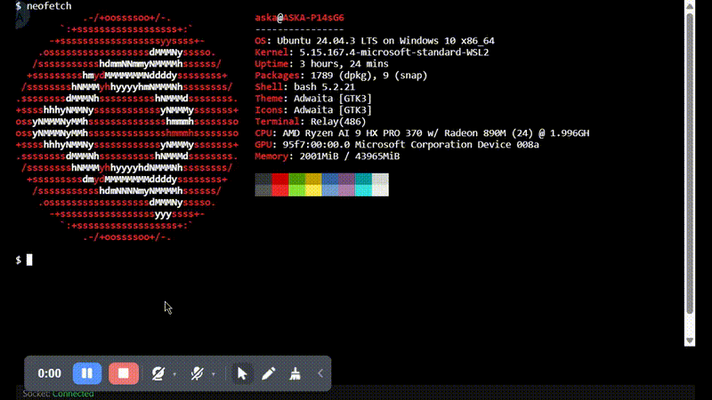

# WebSSH

A lightweight, web-based SSH terminal with advanced features, designed to run on **WSL2**, **Native Windows**, and **macOS**.



## Features

- **Cross-Platform**:
  - **WSL2 Support**: Run and access your WSL terminal from a Windows browser.
  - **Native Windows Support**: Connect to any SSH server (including local OpenSSH) directly from Windows.
  - **macOS Support**: Run the server locally on macOS and connect to localhost or any reachable SSH server.
  - **Unified Runtime**: Uses `threading` mode by default on all platforms for consistent behavior.
- **URL Overlay**: Select a URL or image link in the terminal, right-click (or left-click on selection), and open it in a resizable, draggable overlay window without leaving the terminal.
- **Terminal PiP (Picture-in-Picture)**: Pop the entire terminal into a system-level floating window to keep an eye on tasks while working in other apps.
- **Security**:
  - **Random Token Authentication**: Each session generates a unique token to prevent unauthorized access.
  - **Local Binding**: The server binds specifically to the WSL IP or localhost by default.
- **Performance**:
  - **Fast Startup**: Uses flag files to skip redundant dependency checks.
  - **Offline Ready**: Includes local fallbacks for `xterm.js` and `socket.io`.

## Prerequisites

- **Python 3.10+**
- **WSL2** (optional, for WSL mode)
- **OpenSSH Server / Remote Login** (for connecting to localhost)

## Quick Start

### For macOS / Linux / WSL Users
1. Clone the repository.
2. Run the automated starter:
   ```bash
   ./run.sh
   ```
3. Open the generated URL in your browser.
4. On macOS, enable **Remote Login** in System Settings if you want to SSH into `127.0.0.1`.

For WSL2, the generated URL will usually use your WSL IP (for example `http://172.x.x.x:5000/?token=...`) so you can open it from a Windows browser.

### macOS Notes

If you want WebSSH to connect to your own Mac with `127.0.0.1:22`, you need to enable the macOS SSH server first:

1. Open **System Settings > General > Sharing**.
2. Turn on **Remote Login**.
3. Prefer **Only these users** and add the macOS account you want WebSSH to use.

If you only need WebSSH to SSH back into the same Mac, it is safer to make `sshd` listen only on loopback instead of all network interfaces.

1. Edit `/etc/ssh/sshd_config` as root.
2. Add:
   ```sshconfig
   ListenAddress 127.0.0.1
   ListenAddress ::1
   ```
3. Re-enable **Remote Login** or restart `sshd` so the setting takes effect.

Why this is recommended:

- OpenSSH listens on all local addresses by default.
- macOS Firewall helps block unwanted incoming connections, but binding `sshd` to `127.0.0.1` / `::1` is a stricter control and avoids exposing port `22` to your LAN if firewall rules change later.
- If you do want to SSH into this Mac from another machine, do **not** set `ListenAddress` to loopback only.

### For Native Windows Users
1. Clone the repository.
2. Run the automated batch file:
   ```batch
   run.bat
   ```
3. Open the generated URL in your browser.
4. Enter the **Host** (default `127.0.0.1`) and **Port** (default `22`) to connect.

## Project Structure

- `app.py`: Flask-SocketIO backend bridging WebSocket and Paramiko SSH.
- `templates/index.html`: Frontend using xterm.js with custom overlay and PiP logic.
- `static/`: Local assets for offline support.
- `tools/`: Python virtual environments (separated per platform).

## License

MIT
